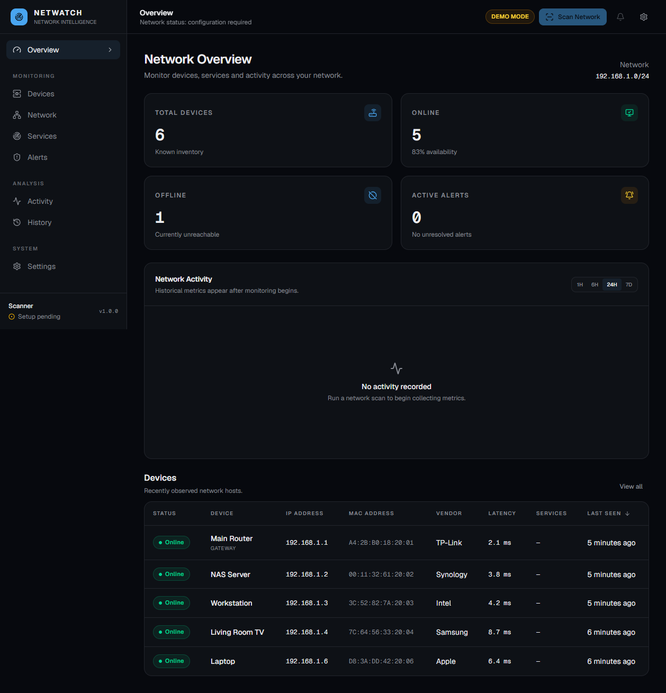
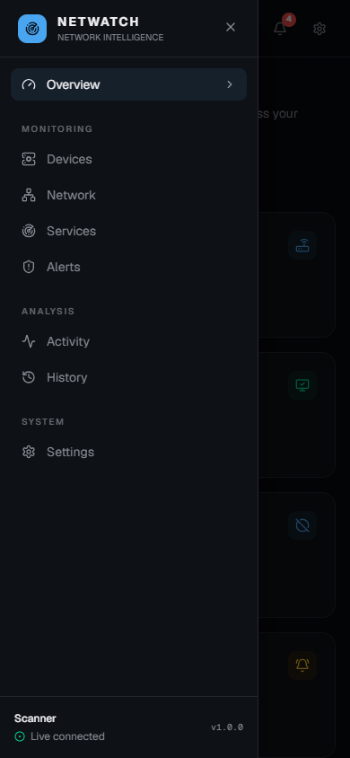
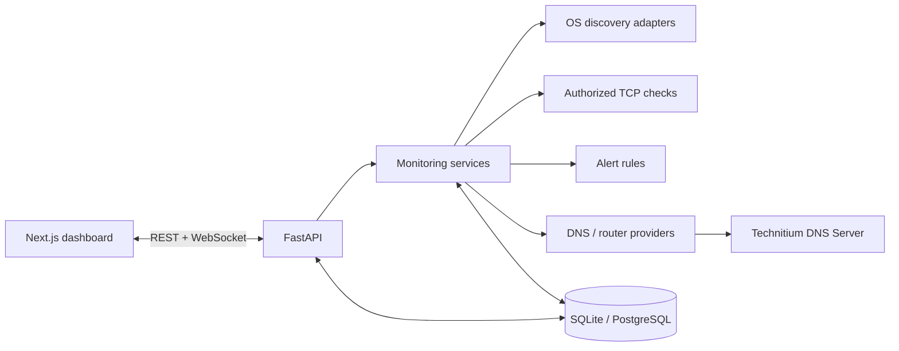

# NetWatch

**Know what's on your network.**

NetWatch is an open-source, self-hosted network monitoring dashboard for discovering devices, tracking availability, monitoring exposed services, and detecting changes across authorized local networks.

> NetWatch is intended only for networks you own or are explicitly authorized to administer. Public Internet targets are rejected by default.

## Features

- Dark-first, responsive network operations dashboard
- FastAPI REST API with OpenAPI documentation
- WebSocket transport for real-time updates
- Async SQLAlchemy database layer with Alembic migrations
- Strict private-subnet and scanner configuration validation
- Bounded, non-overlapping local discovery with platform-aware ping and neighbor-table enrichment
- Persisted manual scan records with demo-safe execution
- Live dashboard updates with reconnecting WebSocket transport
- Historical activity charts, device metrics, event filters, and LAN mapping
- Runtime-editable network, scanner, alert, service, and retention settings
- Capability-aware provider architecture that never invents unsupported controls
- Technitium DNS Server integration with query logging, statistics, managed website rules, and client policy groups
- Per-device Internet activity with inferred services, DNS-derived categories, and blocked-request explanations
- Separate network profiles that keep hotspot/Wi-Fi inventories and scan history isolated
- Guided first-run readiness checks for discovery, current-network identity, Technitium, DNS routing, and router capabilities
- Portfolio-ready network reports with print support and CSV export for devices, alerts, and DNS metadata
- Administrator-managed device names, owners, types, trust states, and household profile assignments
- Parental profiles with schedules, category preferences, and permanent or temporary website rules
- Capability-aware access control and a complete audit trail for successful and failed actions
- Confirmed historical-data cleanup that preserves device and service inventory
- Automated backend and frontend checks through GitHub Actions
- Docker Compose development and deployment path
- Honest empty, loading, and error states with no generated production metrics

The ten implementation phases cover the runnable foundation, device inventory, private-network discovery, scheduled monitoring, conservative service checks, alerts, real-time updates, analytics, responsive accessibility, and production-readiness checks.

## Screenshots





## Architecture



See [docs/architecture.md](docs/architecture.md) for the component boundaries and scanning design.

## Technology Stack

- Frontend: Next.js App Router, React, TypeScript, Tailwind CSS, shadcn/ui source components, Lucide, Recharts
- Backend: Python, FastAPI, Pydantic, async SQLAlchemy, asyncio, WebSockets
- Data: SQLite for development with an async PostgreSQL-compatible configuration path
- Infrastructure: Docker, Docker Compose, environment-based configuration

## Installation

Requirements:

- Node.js 24 or a compatible current LTS release
- Python 3.12+

Create the local environment file:

```bash
cp .env.example .env
```

Start the backend:

```bash
cd backend
python -m venv .venv
# Windows: .venv\Scripts\activate
# macOS/Linux: source .venv/bin/activate
pip install -r requirements-dev.txt
alembic upgrade head
uvicorn main:app --reload
```

Start the frontend in another terminal:

```bash
cd frontend
npm install
npm run dev
```

Open `http://localhost:3000`. API documentation is available at `http://localhost:8000/docs` in development.

## Docker Installation

```bash
cp .env.example .env
docker compose up --build
```

The normal bridge-network configuration is suitable for the dashboard and API. Low-level ARP/ICMP discovery may require host networking or additional capabilities on Linux and behaves differently under Docker Desktop on macOS and Windows. NetWatch will expose those limitations rather than inventing results.

### Windows physical-network sensor

Docker Desktop normally hides the physical Wi-Fi/Ethernet ARP table from Linux containers. On
Windows, start NetWatch's loopback-only sensor before Compose to expose only validated discovery
facts to the backend:

```powershell
.\scripts\start-windows-sensor.ps1
docker compose up -d --build
```

Then set `AUTO_DETECT_NETWORK=true` and
`NETWATCH_HOST_SENSOR_URL=http://host.docker.internal:8765`. The sensor binds only to
`127.0.0.1`, requires a bearer token derived from `NETWATCH_SECRET_KEY` (or the dedicated sensor
token), and refuses to scan anything except the active RFC 1918 Windows network. It supplies the
physical interface IP, gateway, DNS servers, hostname, and ARP MAC observations. Stop it with:

```powershell
.\scripts\stop-windows-sensor.ps1
```

With automatic detection enabled, the next scan changes the active inventory scope when the PC
moves to another private network. Devices from the previous scope remain in history but are not
mixed into the current Devices, Network, Services, or control views.

Compose also starts the pinned Technitium DNS Server integration. Its administration interface
is available at `http://localhost:5380`. NetWatch automatically provisions Technitium's Query
Logs and Advanced Blocking apps and stores its own managed policy groups separately. The example
configuration publishes DNS on port `5453` for conflict-free local testing. Network-wide DNS
normally requires `TECHNITIUM_DNS_PORT=53` and a router that advertises the NetWatch host as DNS.

## Configuration

### Making DNS activity and website blocking work

NetWatch can only associate DNS activity with a device when that device sends
DNS requests to the configured Technitium server. The Technitium web console
address (normally `http://127.0.0.1:5380`) is not the address to enter as a
client DNS server. In the router's LAN/DHCP settings, advertise the Windows
PC's current LAN address instead, for example `192.168.1.37`, on DNS port 53.

Then reconnect the clients, open a website, and refresh **Internet Activity**.
The Settings page shows the current LAN address, gateway, DNS port, and a live
readiness diagnosis. Reserve the PC address in the router DHCP lease so it does
not change. If Windows Mobile Hotspot or Internet Connection Sharing owns UDP
port 53, it must be disabled before Technitium can receive network-wide DNS;
disabling it can interrupt that hotspot, so use a real router or supported
firewall when the PC must remain the gateway.

DNS activity is metadata: it can show contacted domains and blocked DNS
requests, but HTTPS prevents NetWatch from seeing exact search words, messages,
passwords, or page contents. DNS-only blocking can also be bypassed by direct
IP traffic, encrypted DNS, or a VPN.

Full device blocking or LAN quarantine requires a supported router/firewall
provider such as OpenWrt or OPNsense. pfSense, Hitron/NOS, and mobile hotspots
without a documented control API remain monitoring-only/manual; NetWatch keeps
those actions disabled instead of claiming that a block succeeded.

| Variable | Default | Purpose |
| --- | --- | --- |
| `NETWATCH_ENV` | `development` | Runtime profile |
| `DATABASE_URL` | SQLite async URL | Database connection |
| `DATABASE_ECHO` | `false` | Enables verbose SQL logging for focused debugging |
| `NETWATCH_DEMO_MODE` | `false` | Enables isolated demo fixtures in later phases |
| `NETWATCH_SUBNET` | `192.168.1.0/24` | Authorized private subnet |
| `AUTO_DETECT_NETWORK` | `false` | Follow the active private Windows network when the host sensor is available |
| `NETWATCH_HOST_SENSOR_URL` | none | Loopback host sensor URL; Docker Desktop normally uses `http://host.docker.internal:8765` |
| `NETWATCH_HOST_SENSOR_TOKEN` | derived | Optional dedicated sensor bearer token |
| `HOST_SENSOR_TIMEOUT_SECONDS` | `180` | Maximum time allowed for a host-sensor request |
| `SCAN_INTERVAL` | `60` | Seconds between scheduled scans |
| `SCAN_CONCURRENCY` | `32` | Maximum concurrent network checks |
| `OFFLINE_AFTER_MISSED_SCANS` | `3` | Consecutive misses required before a device is marked offline |
| `MONITORING_ENABLED` | `true` | Enables scheduled background scans |
| `SERVICE_SCAN_ENABLED` | `true` | Enables approved TCP service checks |
| `SERVICE_PORTS` | `22,53,80,443,445,3389` | Approved TCP connection checks |
| `NEW_DEVICE_ALERTS` | `true` | Alerts when a device is first discovered |
| `NEW_DEVICE_POLICY` | `allow_alert` | `allow`, `allow_alert`, `quarantine_alert`, or `block_alert` |
| `DEVICE_OFFLINE_ALERTS` | `true` | Alerts after the configured missed-scan threshold |
| `NEW_SERVICE_ALERTS` | `true` | Alerts when an approved service is newly observed |
| `LATENCY_ALERTS` | `true` | Alerts for substantial latency increases |
| `RETENTION_DAYS` | `30` | Days to retain metrics, events, alerts, and scan records |
| `NETWATCH_TIMEZONE` | `UTC` | IANA timezone used to evaluate profile schedules |
| `CORS_ORIGINS` | `http://localhost:3000` | Comma-separated browser origins |
| `ALLOWED_HOSTS` | `localhost,127.0.0.1` | Accepted HTTP hostnames in production |
| `NETWATCH_SECRET_KEY` | none | Fernet key required to encrypt provider passwords at rest |
| `TECHNITIUM_SERVER_URL` | `http://technitium:5380` | Local Technitium API root used by the backend |
| `TECHNITIUM_USERNAME` | `admin` | Technitium administrator/API username |
| `TECHNITIUM_PASSWORD` | none | Required strong password for the bundled DNS server |
| `TECHNITIUM_DNS_PORT` | `5453` | Host port published for the included DNS listener; use `53` for clients |
| `TECHNITIUM_WEB_PORT` | `5380` | Host port for the Technitium web console |
| `NEXT_PUBLIC_API_URL` | `http://localhost:8000` | Browser-visible API base URL |
| `NEXT_PUBLIC_WS_URL` | `ws://localhost:8000/ws` | Browser-visible WebSocket endpoint |
| `NETWATCH_INTERNAL_API_URL` | `http://backend:8000` in Compose | Backend URL used by server-rendered frontend pages |

Configuration is validated at backend startup. Public networks, host addresses supplied as networks, IPv6 targets, overly broad ranges, unsafe intervals, and unbounded concurrency are rejected.

Generate `NETWATCH_SECRET_KEY` before saving an integration:

```bash
python -c "from cryptography.fernet import Fernet; print(Fernet.generate_key().decode())"
```

Technitium is configured from **Settings → Technitium DNS Server**. Enter the local server root URL (for example `http://192.168.1.2:5380`), not an `/api` path. NetWatch accepts only local/private provider destinations.

## Internet Activity

The Internet Activity page associates Technitium DNS records with inventory devices by local IP address. It displays the device name, contacted domain, inferred service, category, provider result, and whether the request was blocked. A device appears only when it uses the configured Technitium instance for DNS and the deployment preserves the original client IP.

DNS records are observations, not exact usage time. Seeing `youtube.com` means the device requested that domain; it does not prove which page or video was viewed.

The Settings page includes a readiness checklist and a diagnostic view. It distinguishes a healthy
configuration from a provider that is unavailable, not configured, or unsupported. IP-to-device
attribution also considers the stored local address history, so a DHCP address change does not
silently attach old DNS records to the wrong device. The **Reports** page provides a printable
snapshot and CSV exports of the data currently loaded; exports are intentionally limited to the
same metadata NetWatch can observe.

## Parental Controls

Open **Control → Parental Controls** to create profiles, assign devices, save allowed Internet windows, choose category-policy preferences, and add custom allow or block rules. Rule precedence is designed around explicit scope: device-specific rules are more specific than profile rules, which are more specific than global rules. Temporary rules expire automatically.

Custom domain rules are sent to Technitium Advanced Blocking only after the provider confirms the required capability. A profile or device rule with no assigned client remains visibly pending. Category selections remain policy preferences until a maintained category list is explicitly mapped; the capability matrix shows this honestly.

## Website Blocking

Open **Control → Website Blocking** to add, verify, retry, and remove network-wide rules. Website rules accept normalized domain names such as `example.com`; arbitrary URLs, paths, commands, and public scan targets are rejected. Subdomain blocking uses Technitium policy groups. Allow rules always include subdomains to keep precedence predictable.

## Category Filtering

NetWatch stores maintainable category policy identifiers and reports DNS-derived categories in activity logs. It does not silently subscribe users to third-party blocklists. The Technitium adapter supports managed filter lists, but category checkboxes remain policy preferences until the administrator chooses reviewed lists for each category. Custom network/profile rules are enforced immediately.

## Device Access Control

Open **Control → Access Control** or the **Access** tab on a device. Renaming, ownership, device type, profile assignment, trust, and ignore actions work in NetWatch itself. When Technitium is connected, NetWatch offers per-device DNS containment only after recent query-log evidence confirms that the device is actually using it. For provider-backed control, configure OpenWrt or OPNsense in **Settings → Router integration**. The interface enables only the capabilities the provider confirms; pfSense and NOS/Hitron stay manual when no supported API is available.

Every attempted control action is written to the audit log with its actor, provider, result, timestamp, and message. A failed provider request never changes the displayed device state.

Across Activity and History, devices without an administrator-assigned name keep their discovered hostname when available and include the IP address as an explicit identifier. This prevents multiple unnamed or DHCP-renamed devices from becoming indistinguishable.

## Unknown Device Quarantine

New devices begin as unknown and can generate an alert. The conservative default is **Allow + Alert**. Automatic quarantine or blocking can be selected in Settings, but it is applied only when the configured network provider safely supports the required API. Unsupported automatic actions leave the device unchanged and record a failure instead of simulating success.

## Technitium DNS Setup

1. Generate `NETWATCH_SECRET_KEY` and a strong `TECHNITIUM_PASSWORD` in `.env`.
2. Start the stack with `docker compose up -d --build`; the integration and required DNS apps are prepared automatically.
3. Open `http://localhost:5380` for the Technitium console or **Settings → Technitium DNS Server** for connection status.
4. For network-wide use, publish DNS on port `53` and configure the router DHCP/DNS setting to advertise the NetWatch host address. Merely scanning the LAN does not route DNS through NetWatch.
5. On Windows, `scripts/enable-technitium-port53.ps1` can be run as Administrator to stop Internet Connection Sharing only after checking that Docker and Internet remain available. The script rolls the service back on failure; `scripts/restore-windows-sharedaccess.ps1` restores it explicitly.

If Windows Internet Connection Sharing or another resolver owns port `53`, keep `TECHNITIUM_DNS_PORT=5453` for local testing. Most routers accept only standard DNS port `53`; network-wide activity then requires Technitium on a host where port `53` is available, a dedicated NetWatch gateway, or a router that supports a custom DNS port.

### Windows desktop setup

The desktop installer does not use the Docker hostname `technitium`. If Technitium is
installed on the same Windows PC, configure **Settings → Technitium DNS Server** with:

```text
Server URL:       http://127.0.0.1:5380
Username:         your Technitium administrator
Password:         your current Technitium password
Client DNS port:  53
```

On a fresh Technitium installation, change the default administrator password in the
Technitium console immediately. NetWatch stores the password encrypted in the per-user
application data directory. The desktop shell repairs legacy invalid encryption keys on
startup so that the integration can be saved safely.

NetWatch cannot recover or display a Technitium password. If the password is forgotten, change or
reset it in the Technitium console first, then enter the new password in NetWatch. A blank password
in the NetWatch form intentionally means “reuse the already stored encrypted credential” only when
the server URL and username have not changed. After repeated failed logins, Technitium can apply a
temporary cooldown; wait for it to expire instead of retrying continuously.

To collect DNS activity for other devices, the router DHCP/DNS configuration must advertise
the NetWatch PC's LAN address (for example `192.168.1.43`) as the DNS server. A mobile hotspot
or an ISP router that does not allow custom DHCP/DNS settings cannot transparently send other
clients' DNS through the PC; in that case NetWatch can still monitor devices and show DNS
activity generated by the PC itself, but it cannot attribute the hotspot's clients.

If the Internet page says **No DNS provider configured**, check the URL above, save and test
the connection, then run a scan. If it says **0 queries** after that, the clients are still
using another DNS resolver, the Query Logs app is unavailable, or the router has replaced the
original client IP with its own address.

## Safe Search

Profile Safe Search is retained as an administrator policy preference. The current Technitium adapter does not advertise automatic Safe Search rewriting, so the control remains visibly unavailable instead of claiming enforcement that has not been verified.

## Pi-hole Setup

The DNS provider interface is ready for additional adapters, but a Pi-hole adapter is not shipped in this release. NetWatch does not offer a non-working Pi-hole form or claim capabilities that have not been verified against the configured Pi-hole API version.

## Router Integration

The network-control interface defines capability checks for client inventory, status, Internet blocking, release, quarantine, disconnect, bandwidth metrics, and firewall rules. Technitium supplies a deliberately limited DNS-containment fallback; it never advertises LAN quarantine or firewall control. OpenWrt uses authenticated ubus for UCI changes and the fixed `/etc/init.d/firewall reload` command through `rpcd-mod-file` before reporting success; the router ACL must allow that exact command. OPNsense uses authenticated REST rules and the current private IP owner because standard pf rules do not support MAC matching. The detected NOS/CHITA web interface has a manual Device Filter but no verified public automation API, so NetWatch does not scrape its login or simulate success. pfSense is not advertised as an automated provider until a supported API adapter is verified.

Existing managed OpenWrt rules are reconciled when they are found disabled, and malformed saved router configuration is reported as a provider error while the NetWatch API remains available.

## Windows desktop app

The browser URL at `http://localhost:3000` is the development frontend. The installable desktop
application is the Electron shell in `desktop/`; it supervises the host sensor, FastAPI backend,
and Next standalone frontend on loopback, opens the dashboard in a native window, and stores a
generated valid Fernet encryption key in the per-user NetWatch data directory.

For development, install dependencies once in `frontend/` and `desktop/`, then run
`desktop\scripts\dev.ps1`. To build the Windows installer, run `npm run dist` inside `desktop/`.
That command builds the frontend, stages and validates a clean runtime, and produces the NSIS
installer in `desktop/release/` without copying `.env` secrets. Use `desktop\scripts\start.ps1`
to start the installed-style shell from the repository, and `desktop\scripts\stop.ps1` for a
graceful stop.

The desktop shell keeps checking the frontend during startup for up to one minute,
so a slower first launch recovers automatically instead of remaining on the service
status screen. The Settings page does not wait for the slower readiness diagnostic;
the core configuration loads first and readiness details remain supplemental.

The installer is a local monitoring client, not a replacement router. Automatic device blocking
requires an authenticated OpenWrt or OPNsense integration with the advertised capability. NOS/Hitron
web consoles remain manual because NetWatch has no verified public control API for them.

## HTTPS, Encrypted DNS, and VPN Limitations

HTTPS prevents NetWatch from reading search text, exact videos, messages, passwords, forms, and page contents. NetWatch does not perform TLS interception or install certificates. DNS visibility and filtering can be bypassed by VPNs, Tor, proxies, hardcoded DNS, DNS-over-HTTPS, or DNS-over-TLS unless legitimate router/firewall controls enforce the approved DNS path. Possible VPN use may only be presented as an inference from metadata, never as certainty.

## Privacy

Internet records contain only the metadata supplied by configured infrastructure: device/profile association, local client IP, domain, inferred category/service, timestamp, DNS result, and matching rule. NetWatch does not store page contents, messages, passwords, form data, or encrypted payloads. Historical activity follows the configured retention period and can be cleared without deleting device inventory.

## Demo Mode

Set `NETWATCH_DEMO_MODE=true` to enable the isolated demo dataset. Demo records are never mixed with live scan results, and the interface displays a visible `DEMO MODE` badge.

## API Documentation

FastAPI publishes OpenAPI at `/docs` and ReDoc at `/redoc` outside production. The Phase 1 health endpoint is `GET /api/health`, and the real-time transport is available at `/ws`.

`GET /api/network/profiles` returns current and previously observed network contexts without mixing their inventories. `GET /api/readiness` returns secret-free deployment diagnostics for the database, discovery
adapter, current network identity, Technitium query history, and router-control capabilities. A
degraded readiness result is returned as HTTP 200 so the Settings page can explain the next step;
`/api/health` remains the liveness endpoint.

Runtime configuration is available through `GET /api/settings` and `PATCH /api/settings`. Historical metrics, events, alerts, and scan records can be removed with `DELETE /api/settings/history`; device inventory, active services, and application settings are preserved.

## Security

- Scan scope is restricted to one validated private IPv4 subnet by default.
- CORS is allow-listed and credentials are disabled.
- ORM queries and typed schemas are used for data access and validation.
- Request sizes are bounded and responses receive defensive browser headers.
- Production mode validates host headers, enables HSTS, and disables interactive API docs.
- Detailed server failures are logged without exposing Python tracebacks in the UI.
- Provider passwords are encrypted at rest and are never returned by the API.
- Provider URLs are restricted to local destinations to reduce server-side request-forgery risk.
- NetWatch does not include stealth scanning, exploitation, credential attacks, or control-bypass behavior.

NetWatch does not currently provide multi-user authentication. Keep it on a trusted network or place it behind an authenticated reverse proxy. See [SECURITY.md](SECURITY.md) for the deployment boundary and vulnerability reporting process.

## Limitations

ARP tables, ICMP permissions, hostname resolution, and interface access vary by host OS and container runtime. Discovery will use replaceable platform adapters and report unsupported capabilities explicitly. A flat LAN does not reveal physical switch topology, so NetWatch will only render a gateway-centered discovered-device map unless stronger evidence is available.

Internet Activity currently represents DNS request metadata supplied by Technitium. It does not inspect packet contents, prove that a website was opened, or measure upload/download bytes. Devices that bypass the configured DNS provider will not appear in this view. Docker Desktop may translate client addresses; use a gateway/native deployment when per-device attribution is required.

## Roadmap

- [x] Phase 1: foundation, database, Docker, and base dashboard
- [x] Phase 2: device models, APIs, inventory UI, detail views, and demo data
- [x] Phase 3: private subnet discovery and scan records
- [x] Phase 4: scheduled monitoring, state changes, events, and latency history
- [x] Phase 5: conservative configurable service detection
- [x] Phase 6: alert rules and alert management
- [x] Phase 7: live WebSocket state and reconnecting frontend client
- [x] Phase 8: analytics, activity, history, and network health charts
- [x] Phase 9: responsive and accessibility polish
- [x] Phase 10: automated tests, security review, and production hardening

## Testing

The backend suite covers private-subnet validation, discovery processing, device transitions, service changes, alert creation, scan APIs, network analytics, and WebSocket events. The frontend suite covers critical rendering and reconnect behavior. GitHub Actions runs formatting, linting, typing, tests, and the production frontend build on pushes and pull requests.

## Contributing

See [CONTRIBUTING.md](CONTRIBUTING.md) for local checks and contribution guidelines.

## License

NetWatch is available under the MIT License. See [LICENSE](LICENSE).
