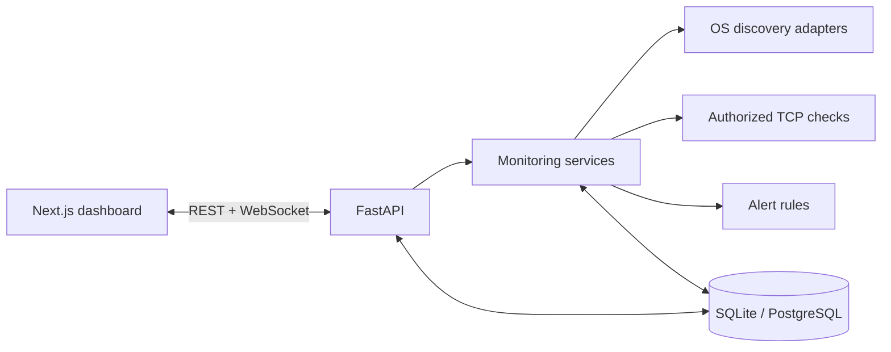

# NetWatch

**Know what's on your network.**

NetWatch is an open-source, self-hosted network monitoring dashboard for discovering devices, tracking availability, monitoring exposed services, and detecting changes across authorized local networks.

> NetWatch is intended only for networks you own or are explicitly authorized to administer. Public Internet targets are rejected by default.

## Features

- Dark-first, responsive network operations dashboard
- FastAPI REST API with OpenAPI documentation
- WebSocket transport for real-time updates
- Async SQLAlchemy database layer with Alembic migrations
- Strict private-subnet and scanner configuration validation
- Bounded, non-overlapping local discovery with platform-aware ping and neighbor-table enrichment
- Persisted manual scan records with demo-safe execution
- Docker Compose development and deployment path
- Honest empty, loading, and error states with no generated production metrics

Phases 1–6 establish the runnable application foundation, device inventory, private-network discovery, scheduled monitoring, service checks, state-change history, and actionable alerts. Live frontend updates and broader analytics follow in the subsequent project phases.

## Screenshots


## Architecture



See [docs/architecture.md](docs/architecture.md) for the component boundaries and scanning design.

## Technology Stack

- Frontend: Next.js App Router, React, TypeScript, Tailwind CSS, shadcn/ui source components, Lucide, Recharts
- Backend: Python, FastAPI, Pydantic, async SQLAlchemy, asyncio, WebSockets
- Data: SQLite for development with an async PostgreSQL-compatible configuration path
- Infrastructure: Docker, Docker Compose, environment-based configuration

## Installation

Requirements:

- Node.js 24 or a compatible current LTS release
- Python 3.12+

Create the local environment file:

```bash
cp .env.example .env
```

Start the backend:

```bash
cd backend
python -m venv .venv
# Windows: .venv\Scripts\activate
# macOS/Linux: source .venv/bin/activate
pip install -r requirements-dev.txt
alembic upgrade head
uvicorn main:app --reload
```

Start the frontend in another terminal:

```bash
cd frontend
npm install
npm run dev
```

Open `http://localhost:3000`. API documentation is available at `http://localhost:8000/docs` in development.

## Docker Installation

```bash
cp .env.example .env
docker compose up --build
```

The normal bridge-network configuration is suitable for the dashboard and API. Low-level ARP/ICMP discovery may require host networking or additional capabilities on Linux and behaves differently under Docker Desktop on macOS and Windows. NetWatch will expose those limitations rather than inventing results.

## Configuration

| Variable | Default | Purpose |
| --- | --- | --- |
| `NETWATCH_ENV` | `development` | Runtime profile |
| `DATABASE_URL` | SQLite async URL | Database connection |
| `DATABASE_ECHO` | `false` | Enables verbose SQL logging for focused debugging |
| `NETWATCH_DEMO_MODE` | `false` | Enables isolated demo fixtures in later phases |
| `NETWATCH_SUBNET` | `192.168.1.0/24` | Authorized private subnet |
| `SCAN_INTERVAL` | `60` | Seconds between scheduled scans |
| `SCAN_CONCURRENCY` | `32` | Maximum concurrent network checks |
| `OFFLINE_AFTER_MISSED_SCANS` | `3` | Consecutive misses required before a device is marked offline |
| `MONITORING_ENABLED` | `true` | Enables scheduled background scans |
| `SERVICE_SCAN_ENABLED` | `true` | Enables approved TCP service checks |
| `SERVICE_PORTS` | `22,53,80,443,445,3389` | Approved TCP connection checks |
| `NEW_DEVICE_ALERTS` | `true` | Alerts when a device is first discovered |
| `DEVICE_OFFLINE_ALERTS` | `true` | Alerts after the configured missed-scan threshold |
| `NEW_SERVICE_ALERTS` | `true` | Alerts when an approved service is newly observed |
| `LATENCY_ALERTS` | `true` | Alerts for substantial latency increases |
| `CORS_ORIGINS` | `http://localhost:3000` | Comma-separated browser origins |
| `NEXT_PUBLIC_API_URL` | `http://localhost:8000` | Browser-visible API base URL |

Configuration is validated at backend startup. Public networks, host addresses supplied as networks, IPv6 targets, overly broad ranges, unsafe intervals, and unbounded concurrency are rejected.

## Demo Mode

Set `NETWATCH_DEMO_MODE=true` to enable the isolated demo dataset. Demo records are never mixed with live scan results, and the interface displays a visible `DEMO MODE` badge.

## API Documentation

FastAPI publishes OpenAPI at `/docs` and ReDoc at `/redoc` outside production. The Phase 1 health endpoint is `GET /api/health`, and the real-time transport is available at `/ws`.

## Security

- Scan scope is restricted to one validated private IPv4 subnet by default.
- CORS is allow-listed and credentials are disabled.
- ORM queries and typed schemas are used for data access and validation.
- Request sizes are bounded and responses receive defensive browser headers.
- Detailed server failures are logged without exposing Python tracebacks in the UI.
- NetWatch does not include stealth scanning, exploitation, credential attacks, or control-bypass behavior.

## Limitations

ARP tables, ICMP permissions, hostname resolution, and interface access vary by host OS and container runtime. Discovery will use replaceable platform adapters and report unsupported capabilities explicitly. A flat LAN does not reveal physical switch topology, so NetWatch will only render a gateway-centered discovered-device map unless stronger evidence is available.

## Roadmap

- [x] Phase 1: foundation, database, Docker, and base dashboard
- [x] Phase 2: device models, APIs, inventory UI, detail views, and demo data
- [x] Phase 3: private subnet discovery and scan records
- [x] Phase 4: scheduled monitoring, state changes, events, and latency history
- [x] Phase 5: conservative configurable service detection
- [x] Phase 6: alert rules and alert management
- [ ] Phase 7: live WebSocket state and reconnecting frontend client
- [ ] Phase 8: analytics, activity, history, and network health charts
- [ ] Phase 9: responsive and accessibility polish
- [ ] Phase 10: complete test suite, security review, and production hardening

## Contributing

Keep networking operations inside `backend/services`, validate all scan targets, add migrations for schema changes, and include tests for state transitions. Run frontend lint/type checks and backend Ruff/Pytest before opening a pull request.

## License

NetWatch is available under the MIT License. See [LICENSE](LICENSE).
