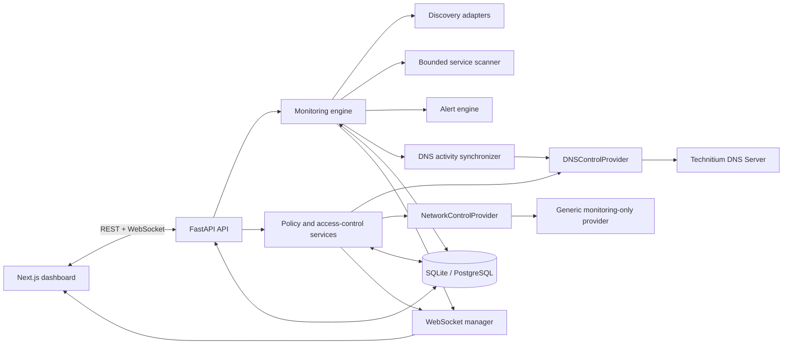

# NetWatch Architecture

NetWatch separates browser presentation, application APIs, persistence, and network operations so each area can evolve independently.

## Boundaries

- `frontend/` owns the dashboard, client state, API client, and real-time reconnection behavior.
- `backend/api/` translates HTTP and WebSocket traffic into service calls.
- `backend/services/` owns discovery, scanning, monitoring, alerting, policy evaluation, provider adapters, and real-time delivery.
- `backend/database/` owns async SQLAlchemy sessions and Alembic migrations.
- `backend/models/` and `backend/schemas/` keep persistence models separate from API contracts.

The scanner only accepts the configured private subnet. Platform discovery implementations sit behind an adapter interface because ARP and ICMP availability differs between Windows, Linux, macOS, and container networking.

DNS activity is accepted only from a configured provider and is associated with an inventory device by local client IP. Unmatched provider clients are not attributed to a person or device. Domain classification is an inference and never represents decrypted page content or exact usage time.

Control operations follow capability checks before changing application state. Technitium can enforce managed global and per-client DNS policy groups and supply query history. The default network provider is deliberately read-only: pause, block, and quarantine actions stay disabled until a legitimate router/firewall adapter confirms that capability. Provider credentials are encrypted at rest and omitted from API responses.
