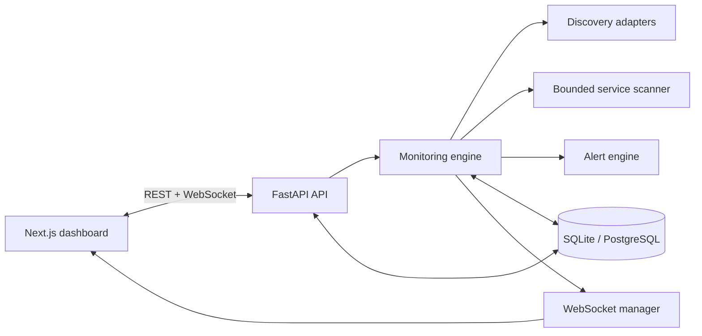

# NetWatch Architecture

NetWatch separates browser presentation, application APIs, persistence, and network operations so each area can evolve independently.

## Boundaries

- `frontend/` owns the dashboard, client state, API client, and real-time reconnection behavior.
- `backend/api/` translates HTTP and WebSocket traffic into service calls.
- `backend/services/` owns discovery, scanning, monitoring, alerting, and real-time delivery.
- `backend/database/` owns async SQLAlchemy sessions and Alembic migrations.
- `backend/models/` and `backend/schemas/` keep persistence models separate from API contracts.

The scanner will only accept the configured private subnet. Platform discovery implementations will sit behind an adapter interface because ARP and ICMP availability differs between Windows, Linux, macOS, and container networking.

